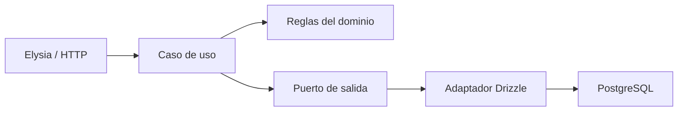

# Arquitectura hexagonal de API Artesanías

La API se organiza como un monolito modular. Cada módulo separa el núcleo de
negocio de los adaptadores externos:



## Reglas que quedan protegidas

- El dinero se guarda en centavos (`integer`), nunca en `float`.
- Un surtido calcula mercancía, gastos extra e inversión total en el núcleo.
- Los gastos extra se distribuyen entre las piezas y los centavos restantes se
  asignan en orden estable.
- El adaptador escribe compra, lotes y entradas de inventario dentro de una
  sola transacción.
- El dominio no conoce Elysia, Drizzle, PostgreSQL ni variables de entorno.

## Firma de la función principal

```ts
type RegisterPurchaseInput = {
  supplierId: string
  purchaseDate: Date | string
  costs: {
    transportCents?: number
    loadingCents?: number
    packagingCents?: number
    foodCents?: number
    otherCents?: number
  }
  items: Array<{
    productId: string
    quantity: number
    supplierUnitCostCents: number
  }>
  notes?: string | null
  createdBy: string
}

function createRegisterPurchaseUseCase(
  persistence: PurchasePersistencePort,
): (input: RegisterPurchaseInput) => Promise<unknown>
```

La implementación vive en
`src/modules/purchases/application/register-purchase.ts`. El contrato de
persistencia está en `purchase.ports.ts` y su implementación PostgreSQL en
`adapters/purchase.drizzle-adapter.ts`.

## Manejo de errores

La función rechaza la operación antes de persistir cuando:

- no hay productos;
- la fecha no es válida;
- una cantidad no es un entero positivo;
- un costo no es un entero no negativo.

El adaptador lanza el error transaccional si PostgreSQL no puede crear un lote
o un movimiento. La transacción revierte todas las escrituras, evitando una
entrada de inventario sin su surtido correspondiente.

## Ejemplo de uso

```ts
const registerPurchase = createRegisterPurchaseUseCase(purchaseDrizzleAdapter)

const purchase = await registerPurchase({
  supplierId: 'supplier-puebla',
  purchaseDate: new Date(),
  costs: {
    transportCents: 70000,
    loadingCents: 25000,
    packagingCents: 12000,
    foodCents: 18000,
  },
  items: [
    { productId: 'vaso-mediano', quantity: 60, supplierUnitCostCents: 1600 },
    { productId: 'tazon-grande', quantity: 24, supplierUnitCostCents: 4200 },
  ],
  createdBy: 'user-id',
})
```

## Evolución recomendada

El mismo patrón debe aplicarse después a ventas y pedidos: el caso de uso
debe recibir un puerto de inventario que resuelva FIFO, mientras que el
adaptador Drizzle debe bloquear los lotes con `FOR UPDATE`. Así la app móvil
puede cambiar sin reescribir las reglas de inventario.